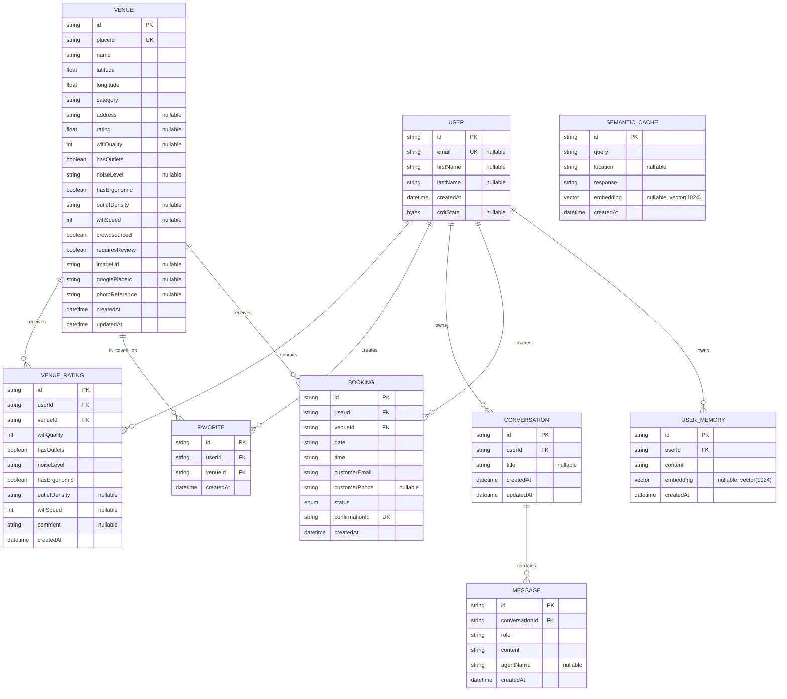

# WorkSphere Database Schema and Prisma Optimization Guide

This document describes the relational database design used by WorkSphere, the relationships implemented through Prisma ORM, the indexes currently defined in `prisma/schema.prisma`, and practical optimization guidance for future growth.

> **Source of truth:** `prisma/schema.prisma`  
> **Database:** PostgreSQL  
> **ORM:** Prisma  
> **PostgreSQL extension:** `vector`  
> **Embedding dimension:** 1024

---

## 1. Schema overview

WorkSphere stores four main categories of data:

1. **Identity and personalization** — `User`, `Favorite`, `UserMemory`
2. **Workspace discovery and community data** — `Venue`, `VenueRating`
3. **Conversation history** — `Conversation`, `Message`
4. **Reservations and semantic caching** — `Booking`, `SemanticCache`

The database uses string primary keys. Most application-generated records use Prisma's `cuid()` default. `User.id` is supplied by the authentication system rather than generated by Prisma.

---

## 2. Entity relationship diagram



### Relationship cardinality summary

| Parent | Child | Cardinality | Foreign key |
|---|---|---:|---|
| `User` | `VenueRating` | One-to-many | `VenueRating.userId` |
| `Venue` | `VenueRating` | One-to-many | `VenueRating.venueId` |
| `User` | `Favorite` | One-to-many | `Favorite.userId` |
| `Venue` | `Favorite` | One-to-many | `Favorite.venueId` |
| `User` | `Conversation` | One-to-many | `Conversation.userId` |
| `Conversation` | `Message` | One-to-many | `Message.conversationId` |
| `User` | `Booking` | One-to-many | `Booking.userId` |
| `Venue` | `Booking` | One-to-many | `Booking.venueId` |
| `User` | `UserMemory` | One-to-many | `UserMemory.userId` |

`SemanticCache` is intentionally independent. Cached semantic results are not owned by a user or venue.

---

## 3. Model reference

### 3.1 User

`User` represents an authenticated WorkSphere account.

| Field | Type | Constraints | Purpose |
|---|---|---|---|
| `id` | `String` | Primary key | Authentication-provider user identifier |
| `email` | `String?` | Unique, nullable | User email |
| `firstName` | `String?` | Nullable | Given name |
| `lastName` | `String?` | Nullable | Family name |
| `createdAt` | `DateTime` | Defaults to `now()` | Account creation time |
| `crdtState` | `Bytes?` | Nullable | Serialized CRDT state |

Relations: `favorites`, `ratings`, `conversations`, `bookings`, `memories`.

`User.id` does not use `cuid()`. The application must provide an ID, normally using the external authentication provider's user ID.

### 3.2 Venue

`Venue` stores work-friendly location data for cafés, coworking spaces, libraries, and similar venues.

Important identifiers:

- `id`: internal primary key
- `placeId`: unique external/location-provider identity
- `googlePlaceId`: optional Google Places identity

Relations: `ratings`, `favorites`, `bookings`.

### 3.3 VenueRating

`VenueRating` stores one rating per user per venue. The composite uniqueness constraint:

```prisma
@@unique([userId, venueId])
```

prevents duplicate rating rows. Use `upsert` when users revise ratings.

### 3.4 Favorite

`Favorite` is a join model between `User` and `Venue`.

```prisma
@@unique([userId, venueId])
```

prevents the same user from favoriting the same venue more than once.

### 3.5 Conversation and Message

A `Conversation` belongs to one user and contains multiple `Message` rows. `Message.conversationId` is indexed for efficient chat-history retrieval.

Recommended ownership-safe query:

```ts
const conversation = await prisma.conversation.findFirst({
  where: { id: conversationId, userId },
  include: {
    messages: { orderBy: { createdAt: "asc" } },
  },
});
```

### 3.6 Booking

`Booking` connects a user to a venue reservation. `confirmationId` is unique and suitable for customer-facing lookup; internal joins should continue using `id`.

The current schema stores `date` and `time` as strings. This is simple for UI display but limits range filtering and database-level time validation.

### 3.7 UserMemory

`UserMemory` stores user-specific semantic memory with an optional `vector(1024)` embedding.

Because Prisma exposes the field as `Unsupported("vector(1024)")`, similarity queries may require parameterized `$queryRaw` SQL.

### 3.8 SemanticCache

`SemanticCache` stores shared cache entries and optional embeddings. It has no foreign key because cache records are infrastructure data rather than user-owned records.

---

## 4. Existing indexes and impact

| Model | Index or constraint | Primary use | Performance impact |
|---|---|---|---|
| `User` | Unique `email` | Account lookup | Avoids full scans for email lookup |
| `Venue` | Unique `placeId` | Venue deduplication/upsert | Fast external identity lookup |
| `Venue` | `@@index([latitude, longitude])` | Bounding-box filtering | Helps coordinate predicates |
| `Venue` | `@@index([category])` | Category filtering | Speeds café/coworking/library filtering |
| `VenueRating` | `@@unique([userId, venueId])` | Rating upsert | Prevents duplicates; speeds exact lookup |
| `VenueRating` | `@@index([venueId])` | Rating aggregation | Speeds venue-rating retrieval |
| `Favorite` | `@@unique([userId, venueId])` | Favorite toggle | Prevents duplicates |
| `Favorite` | `@@index([userId])` | Favorites page | Speeds user-scoped lists |
| `Conversation` | `@@index([userId])` | Conversation history | Speeds user history |
| `Message` | `@@index([conversationId])` | Message history | Speeds chat loading |
| `Booking` | `@@index([userId])` | User bookings | Speeds booking history |
| `Booking` | `@@index([venueId])` | Venue reservations | Speeds venue booking lookup |
| `UserMemory` | `@@index([userId])` | Personal memory retrieval | Speeds user-scoped memory queries |
| `SemanticCache` | `@@index([query])` | Exact-query cache lookup | Avoids full cache scans |

### Coordinate-index limitation

The B-tree index on `(latitude, longitude)` helps rectangular bounding-box queries, but it is not a true geospatial distance index. For large datasets, use PostGIS with a GiST index.

---

## 5. Referential actions and deletion behavior

The current schema does **not** declare explicit `onDelete` or `onUpdate` actions.

For required relations, deletion of a parent with dependent rows is normally rejected until children are removed.

| Deleting | Current result while dependents exist |
|---|---|
| `User` with ratings, favorites, conversations, bookings, or memories | Rejected until child rows are removed |
| `Venue` with ratings, favorites, or bookings | Rejected until child rows are removed |
| `Conversation` containing messages | Rejected until messages are removed |

### Important clarification

- The current schema does **not** contain anonymous reviews.
- Every `VenueRating` requires a valid `userId`.
- User deletion does **not** currently cascade automatically to bookings or other children.

### Application-level safe deletion

```ts
await prisma.$transaction(async (tx) => {
  await tx.message.deleteMany({
    where: { conversation: { userId } },
  });
  await tx.conversation.deleteMany({ where: { userId } });
  await tx.favorite.deleteMany({ where: { userId } });
  await tx.venueRating.deleteMany({ where: { userId } });
  await tx.booking.deleteMany({ where: { userId } });
  await tx.userMemory.deleteMany({ where: { userId } });
  await tx.user.delete({ where: { id: userId } });
});
```

### Optional schema-level cascade

```prisma
user User @relation(
  fields: [userId],
  references: [id],
  onDelete: Cascade
)
```

Do not add cascade rules casually. Booking and audit data may require retention, anonymization, or soft deletion.

---

## 6. Common query patterns

### Nearby venues using a bounding box

```ts
const venues = await prisma.venue.findMany({
  where: {
    latitude: { gte: minLatitude, lte: maxLatitude },
    longitude: { gte: minLongitude, lte: maxLongitude },
    category,
  },
  take: 50,
});
```

Use the bounding box to reduce candidates, then calculate exact great-circle distance in a second step.

### Venue details with bounded community data

```ts
const venue = await prisma.venue.findUnique({
  where: { id: venueId },
  include: {
    ratings: {
      orderBy: { createdAt: "desc" },
      take: 20,
    },
    _count: {
      select: { ratings: true, favorites: true },
    },
  },
});
```

### User dashboard

```ts
const userData = await prisma.user.findUnique({
  where: { id: userId },
  select: {
    firstName: true,
    favorites: {
      include: { venue: true },
      orderBy: { createdAt: "desc" },
    },
    bookings: {
      include: { venue: true },
      orderBy: { createdAt: "desc" },
      take: 20,
    },
  },
});
```

### Cursor-paginated conversation history

```ts
const conversations = await prisma.conversation.findMany({
  where: { userId },
  orderBy: { updatedAt: "desc" },
  take: pageSize + 1,
  ...(cursor ? { cursor: { id: cursor }, skip: 1 } : {}),
});
```

Cursor pagination is preferred over large offsets.

---

## 7. Prisma performance guidelines

### Select only required fields

```ts
const venues = await prisma.venue.findMany({
  select: {
    id: true,
    name: true,
    latitude: true,
    longitude: true,
    rating: true,
  },
});
```

### Avoid N+1 queries

```ts
const venues = await prisma.venue.findMany({
  include: {
    _count: { select: { ratings: true } },
  },
});
```

### Use transactions for related writes

```ts
await prisma.$transaction([
  prisma.booking.create({ data: bookingData }),
  prisma.conversation.update({
    where: { id: conversationId },
    data: { updatedAt: new Date() },
  }),
]);
```

### Use `upsert` for externally identified venues

```ts
await prisma.venue.upsert({
  where: { placeId },
  update: normalizedVenue,
  create: { placeId, ...normalizedVenue },
});
```

### Bound public list queries

Always use `take` and stable ordering for public or user-controlled list endpoints.

### Inspect query plans

```sql
EXPLAIN (ANALYZE, BUFFERS)
SELECT *
FROM "Booking"
WHERE "venueId" = $1
ORDER BY "createdAt" DESC
LIMIT 20;
```

Indexes should be justified by real query plans and representative data.

---

## 8. Recommended future optimizations

These are recommendations and are **not present in the current schema** unless a later migration adds them.

### 8.1 Geospatial optimization

For a large catalog, use PostGIS and a GiST index:

```sql
CREATE EXTENSION IF NOT EXISTS postgis;
CREATE INDEX venue_location_gist
ON "Venue"
USING GIST (location);
```

### 8.2 Booking timestamps

Consider replacing string-based date/time fields with:

```prisma
startsAt DateTime
endsAt   DateTime
@@index([venueId, startsAt])
```

Benefits include range filtering, overlap detection, sorting, validation, and time-zone-aware logic.

For the current schema, a measured optimization may be:

```prisma
@@index([venueId, date])
```

### 8.3 Conversation ordering

If the dashboard frequently filters by user and sorts by recent activity:

```prisma
@@index([userId, updatedAt])
```

### 8.4 Message ordering

```prisma
@@index([conversationId, createdAt])
```

### 8.5 Semantic-cache expiration

```prisma
expiresAt DateTime
@@index([expiresAt])
```

### 8.6 Vector similarity indexes

Example HNSW index:

```sql
CREATE INDEX user_memory_embedding_hnsw
ON "UserMemory"
USING hnsw (embedding vector_cosine_ops);
```

Parameterized similarity query:

```ts
const rows = await prisma.$queryRaw`
  SELECT id, content,
         1 - (embedding <=> ${embedding}::vector) AS similarity
  FROM "UserMemory"
  WHERE "userId" = ${userId}
    AND embedding IS NOT NULL
  ORDER BY embedding <=> ${embedding}::vector
  LIMIT 10
`;
```

Never concatenate untrusted values into raw SQL.

---

## 9. Cascade and retention decision matrix

| Child data | Suggested approach | Reason |
|---|---|---|
| Favorites | Cascade | Personal convenience data has little retention value |
| Conversations/messages | Cascade or user-controlled deletion | Primarily user-owned content |
| User memories | Cascade | Personalization data should disappear with the user |
| Ratings | Anonymize or cascade according to policy | Community value may justify retention |
| Bookings | Retain/anonymize or soft-delete | May be needed for support or reporting |
| Venue-linked ratings/favorites | Usually cascade on permanent venue removal | Meaningless without the venue |
| Venue-linked bookings | Restrict or soft-delete venue | Preserve historical integrity |

A documented retention policy should precede schema-level cascade changes.

---

## 10. Migration workflow

For collaborative and production environments:

```bash
npx prisma format
npx prisma validate
npx prisma migrate dev --name describe_change
npx prisma generate
```

Deployment:

```bash
npx prisma migrate deploy
```

`prisma db push` is useful for local prototyping, while migrations provide reviewable SQL and durable history.

Before merging a migration:

1. Review generated SQL.
2. Back up production data.
3. Test against representative volume.
4. Check lock duration for indexes.
5. Run `EXPLAIN ANALYZE` on affected queries.
6. Confirm rollback or forward-fix strategy.

---

## 11. Security and integrity checklist

- Scope user-owned queries by authenticated `userId`.
- Never trust a client-supplied `userId`.
- Use unique constraints as the final defense against duplicate ratings and favorites.
- Use transactions for dependent writes and deletion workflows.
- Parameterize all raw SQL and pgvector queries.
- Limit public list sizes and validate pagination.
- Do not expose booking contact data from public venue APIs.
- Define booking retention before adding cascades.
- Monitor slow queries and connection-pool saturation.
- Keep Prisma Client as a singleton during development hot reload.

---

## 12. Updating this document

Update this file whenever:

- a Prisma model or relation changes
- an index is added or removed
- a referential action changes
- a migration changes retention behavior
- vector or geospatial indexing is introduced

Validation commands:

```bash
npx prisma format
npx prisma validate
```

The Prisma schema remains the executable source of truth. This guide explains its intent and operational implications but does not replace schema and migration review.
