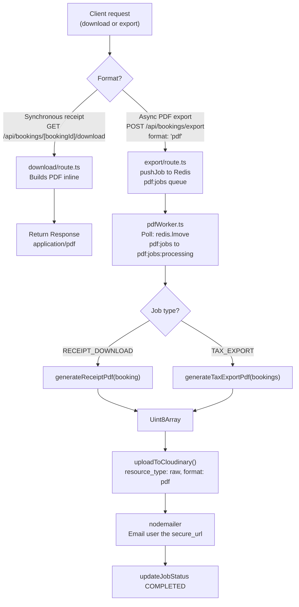

# PDF Compiling Guide

A developer reference for understanding, modifying, and extending the PDF compilation pipeline in WorkSphere.

---

## Table of Contents

1. [Overview](#overview)
2. [Architecture](#architecture)
3. [Template Customization](#template-customization)
4. [Font Customization](#font-customization)
5. [Drawing Commands](#drawing-commands)
6. [Margins](#margins)
7. [Line Spacing](#line-spacing)
8. [Styling Guidelines](#styling-guidelines)
9. [Troubleshooting](#troubleshooting)
10. [Best Practices](#best-practices)

---

## Overview

WorkSphere generates two types of PDF documents:

| Document            | Generator function                                  | Trigger                                                                                         |
| ------------------- | --------------------------------------------------- | ----------------------------------------------------------------------------------------------- |
| **Booking receipt** | `generateReceiptPdf` in `src/lib/pdfGenerator.ts`   | `GET /api/bookings/[bookingId]/download` (synchronous) or `RECEIPT_DOWNLOAD` worker job (async) |
| **Tax export**      | `generateTaxExportPdf` in `src/lib/pdfGenerator.ts` | `POST /api/bookings/export` with `format: "pdf"` → queued as `TAX_EXPORT` worker job            |

All documents are built with [**pdf-lib**](https://pdf-lib.js.org/), a pure-TypeScript library that operates at the byte level — no headless browser, no HTML rendering, no external process.

Custom fonts are loaded from `public/fonts/` at runtime using [**@pdf-lib/fontkit**](https://github.com/Hopding/fontkit), which extends pdf-lib with the ability to embed arbitrary TTF/OTF files with full Unicode support.

Finished PDFs follow one of two delivery paths:

- **Synchronous** (download route): the `Uint8Array` is returned directly as a `Response` with `Content-Type: application/pdf`.
- **Asynchronous** (worker): the `Uint8Array` is uploaded to Cloudinary, and a download link is emailed to the user.

---

## Architecture

### PDF Generation Flow



### Template Compilation Steps

Within each generator function, the document is assembled in this order:

1. `PDFDocument.create()` — allocate a new in-memory document.
2. `pdfDoc.registerFontkit(fontkit)` — enable custom font embedding (receipt only).
3. `pdfDoc.addPage([595, 842])` — add an A4 page (width × height in points at 72 dpi).
4. Embed fonts via `pdfDoc.embedFont(...)`.
5. Call `page.getSize()` to obtain `{ width, height }`.
6. Set the initial `y` cursor at `height - 50`.
7. Draw decorative elements (coloured rectangle header bar).
8. Draw all text sections, decrementing `y` by the appropriate line-height after each draw.
9. Add new pages automatically when `y < 80` (overflow guard in tax export).
10. `pdfDoc.save()` — serialise to `Uint8Array`.

### Document Dimensions

Both generators use A4 portrait at 72 points-per-inch:

```ts
// A4 at 72 dpi
pdfDoc.addPage([595, 842]); // width: 595pt, height: 842pt
```

---

## Template Customization

All layout logic lives in `src/lib/pdfGenerator.ts`. The two exported functions are self-contained: they create their own `PDFDocument`, draw every element, and return the serialised bytes.

### Modifying the Receipt Layout (`generateReceiptPdf`)

The receipt is a single-page document. Its rendering order is:

1. Blue header bar (top 10 pt of the page)
2. Title block (`WORKSPHERE CONFIRMATION` + subtitle)
3. `BOOKING DETAILS:` section — reference ID, venue, category, address, schedule, billing code, customer
4. `SECURITY PROTOCOL:` section
5. Footer line

To add a new section, insert `drawText` calls at the correct `yPosition` and advance `yPosition` by the line-height between each line:

```ts
// Example: add a "NOTES:" section after the footer
yPosition -= 20;
drawText("NOTES:", {
  x: 50,
  y: yPosition,
  size: 12,
  font: boldFont,
});
yPosition -= 18;
drawText("This booking was made via mobile.", {
  x: 50,
  y: yPosition,
  size: 10,
  font,
});
```

### Modifying the Tax Export Layout (`generateTaxExportPdf`)

The tax export produces:

- **One summary page** listing totals and a compact index of all bookings.
- **One detail page per booking** with full line-item breakdown.

To change the summary table format, edit the loop over `bookings` that begins after the overall totals block. The per-booking detail format is in the second `for` loop that calls `pdfDoc.addPage` for each booking.

### Editing Headers

The coloured header bar is a full-width `drawRectangle` positioned at the very top of each page:

```ts
page.drawRectangle({
  x: 0,
  y: height - 10, // bottom edge of the bar is 10pt from the top
  width,
  height: 10,
  color: rgb(0.23, 0.51, 0.96), // WorkSphere brand blue
});
```

To change the header height, adjust both `height: 10` and update the initial `y` cursor offset (`yPosition -= 60`) so that the title text clears the bar.

### Editing Footers

The footer is a plain `drawText` call at a low `yPosition`:

```ts
drawText(
  "Thank you for choosing WorkSphere. Your workspace is ready for you.",
  { x: 100, y: yPosition, size: 8, font, color: rgb(0.4, 0.4, 0.4) },
);
```

For a footer that must appear at a fixed position regardless of content length, set `y` to a fixed low value (e.g., `40`) rather than using the tracked `yPosition` cursor.

### Changing Colors

Colors are expressed as `rgb(r, g, b)` where each channel is a float in `[0, 1]`:

```ts
import { rgb } from "pdf-lib";

rgb(0.23, 0.51, 0.96); // brand blue  (#3A82F5)
rgb(0, 0, 0); // black
rgb(0.5, 0.5, 0.5); // medium grey
rgb(0.6, 0.2, 0.2); // muted red (disclaimer text)
rgb(0.4, 0.4, 0.4); // dark grey (footer)
```

To convert a hex colour: divide each 8-bit channel by 255.

### Separator Lines

Horizontal rules are drawn with repeated dash characters:

```ts
drawText("-".repeat(50), { x: 50, y: yPosition, size: 10, font });
```

To increase or decrease rule length, adjust the `repeat` count.

---

## Font Customization

### Font Loading Strategy

WorkSphere uses a **try/fall-back** approach for fonts. The preferred fonts are Noto Sans (TTF files shipped in `public/fonts/`). If loading fails, the generator falls back to pdf-lib's built-in `StandardFonts.Helvetica` / `StandardFonts.HelveticaBold`.

```text
public/
└── fonts/
    ├── NotoSans-Regular.ttf
    └── NotoSans-Bold.ttf
```

### fontkit Integration

Custom TTF embedding requires fontkit to be registered on the `PDFDocument` instance **before** any `embedFont` call:

```ts
import fontkit from "@pdf-lib/fontkit";

const pdfDoc = await PDFDocument.create();
pdfDoc.registerFontkit(fontkit); // must be called once, before embedFont
```

This step is present in `generateReceiptPdf` and in `download/route.ts`. It is **not** done in `generateTaxExportPdf` because that function uses only `StandardFonts` (no custom TTF).

### Embedding a Custom Font

```ts
import fs from "fs";
import path from "path";

const fontBytes = await fs.promises.readFile(
  path.join(process.cwd(), "public", "fonts", "MyFont-Regular.ttf"),
);
const myFont = await pdfDoc.embedFont(fontBytes);
```

Once embedded, pass `myFont` wherever `font` is expected in `drawText` options.

### Adding a New Font Variant

1. Place the `.ttf` file in `public/fonts/`.
2. Load it with `fs.promises.readFile` (async, used in `generateReceiptPdf`) or `fs.readFileSync` (sync, used in `download/route.ts`).
3. Call `pdfDoc.registerFontkit(fontkit)` if not already done.
4. Embed it with `pdfDoc.embedFont(fontBytes)`.
5. Pass the returned `PDFFont` object to `drawText` calls.

### Unicode Considerations

Standard pdf-lib fonts (`Helvetica`, `HelveticaBold`) only cover the **printable ASCII** range (`\x20`–`\x7E`). Any character outside that range will throw an encoding error at render time.

NotoSans is a Unicode font and handles most Latin, Cyrillic, Greek, and CJK characters correctly when embedded via fontkit.

The `safeText` helper in `src/lib/pdfHelpers.ts` strips non-ASCII characters as a pre-processing safety net:

```ts
// src/lib/pdfHelpers.ts
export const safeText = (text: string) =>
  text ? text.replace(/[^\x00-\x7F]/g, "?") : "";
```

The `drawSafeText` function in `src/lib/pdfHelpers.ts` provides a two-level fallback at render time:

```ts
export function drawSafeText(page, text, options) {
  try {
    page.drawText(text, options); // attempt original text
  } catch {
    const strictText = text.replace(/[^\x20-\x7E]/g, "?");
    page.drawText(strictText, options); // fall back to printable ASCII only
  }
}
```

### Fallback Font

When the custom font files cannot be loaded (e.g., first deploy without assets, CI environment), the generators fall back automatically:

```ts
try {
  font = await pdfDoc.embedFont(regularFontBytes);
  boldFont = await pdfDoc.embedFont(boldFontBytes);
} catch {
  font = await pdfDoc.embedFont(StandardFonts.Helvetica);
  boldFont = await pdfDoc.embedFont(StandardFonts.HelveticaBold);
}
```

The fallback produces valid PDFs but will silently replace non-ASCII characters with `?`.

---

## Drawing Commands

### Coordinate System

pdf-lib uses a **bottom-left origin**. The point `(0, 0)` is the **bottom-left corner** of the page. The Y axis increases **upward**.

```text
(0, 842) ─────────────────── (595, 842)   ← top of A4 page
    │                              │
    │        content area          │
    │                              │
(0, 0)  ─────────────────── (595, 0)      ← bottom of page
```

All `x` and `y` values are in **points** (1 pt = 1/72 inch).

Because the origin is at the bottom, the page is built **top-down** by starting `y` near `height` and **subtracting** after each element:

```ts
let y = height - 50; // start 50pt from the top
drawText("Header", { x: 50, y });
y -= 20; // move cursor down by 20pt
drawText("Body text", { x: 50, y });
```

### `drawText`

Renders a string at a specific position.

```ts
page.drawText(text: string, options: {
  x: number;          // left edge of the text baseline
  y: number;          // baseline Y position
  size: number;       // font size in points
  font: PDFFont;      // embedded font object
  color?: RGB;        // defaults to black
  maxWidth?: number;  // clip text beyond this width (no auto-wrap)
});
```

**Example — body field:**

```ts
page.drawText(`VENUE: ${booking.venue.name}`, {
  x: 50,
  y: yPosition,
  size: 10,
  font,
  color: rgb(0, 0, 0),
});
```

**Example — large title:**

```ts
page.drawText("WORKSPHERE CONFIRMATION", {
  x: 150,
  y: yPosition,
  size: 24,
  font: boldFont,
  color: rgb(0, 0, 0),
});
```

> **Always use `drawSafeText` or the local two-level wrapper** rather than calling `page.drawText` directly on user-supplied strings. This prevents crashes from unexpected Unicode input.

### `drawRectangle`

Draws a filled rectangle. Used for the brand-colour header bar at the top of every page.

```ts
page.drawRectangle({
  x: number;        // left edge
  y: number;        // bottom edge (bottom-left origin)
  width: number;
  height: number;
  color?: RGB;      // fill colour
  borderColor?: RGB;
  borderWidth?: number;
  opacity?: number;
});
```

**Example — full-width blue header bar:**

```ts
page.drawRectangle({
  x: 0,
  y: height - 10, // bottom edge is 10pt from the top of the page
  width, // full page width
  height: 10,
  color: rgb(0.23, 0.51, 0.96),
});
```

> **Why `y: height - 10`?**
> `y` is the _bottom_ edge of the rectangle. The rectangle extends _upward_ by `height: 10`. So `y = height - 10` places the bottom of the bar 10 pt below the page top, and the top of the bar flush with the page top.

### Page Size

```ts
const { width, height } = page.getSize();
// For [595, 842]: width = 595, height = 842
```

---

## Margins

The generators do not use a margin abstraction. Margins are encoded as literal X/Y offsets in every draw call.

### Current Effective Margin Values

| Edge       | Effective value                    | How it is set                                                                |
| ---------- | ---------------------------------- | ---------------------------------------------------------------------------- |
| **Top**    | 50 pt + 60 pt header clearance     | `let y = height - 50`, then `y -= 60` after header bar                       |
| **Left**   | 50 pt                              | `x: 50` on all body text                                                     |
| **Right**  | ~545 pt (no explicit right margin) | Text is not bounded; lines must fit within 495 pt of usable width at `x: 50` |
| **Bottom** | 80 pt overflow guard               | `if (y < 80) { addPage(); y = height - 50; }` (tax export only)              |

### Adjusting Margins

To shift the left margin consistently, extract it as a named constant:

```ts
const MARGIN_LEFT = 50;
const MARGIN_TOP_OFFSET = 50;

let y = height - MARGIN_TOP_OFFSET;
drawText("BOOKING DETAILS:", { x: MARGIN_LEFT, y, size: 12, font: boldFont });
```

To add a soft right margin, use `maxWidth`:

```ts
drawText(longLine, {
  x: 50,
  y: yPosition,
  size: 10,
  font,
  maxWidth: width - 100, // 50pt margin on each side
});
```

> **Note:** pdf-lib does not auto-wrap text. `maxWidth` clips the render visually but does not reflow text. Pre-truncate long strings in application code before passing to `drawText`.

---

## Line Spacing

### Font Size and Vertical Advance

pdf-lib does not calculate line height automatically. The vertical gap between lines is set by decrementing `y` after each `drawText` call.

Values used throughout the codebase:

| Context               | Font size | `y` decrement                                              |
| --------------------- | --------- | ---------------------------------------------------------- |
| Large title           | 24 pt     | 15 pt (title → subtitle)                                   |
| Subtitle / disclaimer | 7–8 pt    | 12 pt                                                      |
| Section header        | 12 pt     | 15 pt (header → separator), 20 pt (separator → first item) |
| Body line             | 9–10 pt   | 18 pt                                                      |
| Between sections      | —         | 30–40 pt extra gap                                         |
| Footer                | 8 pt      | — (last element)                                           |

### Paragraph and Section Spacing

```ts
drawText("BOOKING DETAILS:", { x: 50, y, size: 12, font: boldFont });
y -= 15; // header → separator
drawText("-".repeat(50), { x: 50, y, size: 10, font });
y -= 20; // separator → first field

drawText(`VENUE: ${name}`, { x: 50, y, size: 10, font });
y -= 18; // field → field

y -= 30; // section gap
drawText("PRICING & MEMBERSHIP CHARGES:", {
  x: 50,
  y,
  size: 12,
  font: boldFont,
});
```

### Page Overflow Guard

```ts
if (y < 80) {
  currentPage = pdfDoc.addPage([595, 842]);
  y = height - 50;
}
```

Add this check before each booking or large block in any generator that produces variable-length output.

---

## Styling Guidelines

### Typography

| Use                 | Font                                       | Size                                 |
| ------------------- | ------------------------------------------ | ------------------------------------ |
| Document title      | `boldFont` (NotoSans-Bold / HelveticaBold) | 22–24 pt                             |
| Section header      | `boldFont`                                 | 12 pt                                |
| Body text           | `font` (NotoSans-Regular / Helvetica)      | 9–10 pt                              |
| Subtitle / metadata | `font`                                     | 7–8 pt                               |
| Footer              | `font`                                     | 8 pt                                 |
| Disclaimer          | `font`                                     | 7 pt, muted red `rgb(0.6, 0.2, 0.2)` |

### Consistent Spacing

- Left margin is always `x: 50` for body content.
- Section separators use `"-".repeat(50)` at `size: 10`.
- Inter-line advance is 18 pt for body fields; 30–40 pt between sections.

### Page Breaks

Add new pages by calling `pdfDoc.addPage([595, 842])` and resetting the cursor. Use the same initial offset on continuation pages:

```ts
if (y < 80) {
  currentPage = pdfDoc.addPage([595, 842]);
  y = height - 50;
}
```

### Reusable Helpers

Two shared helpers exist in `src/lib/pdfHelpers.ts`:

| Helper         | Signature                       | Purpose                                                                                                                      |
| -------------- | ------------------------------- | ---------------------------------------------------------------------------------------------------------------------------- |
| `safeText`     | `(text: string) => string`      | Strips non-ASCII characters. Use on all user-supplied data before interpolating into draw strings.                           |
| `drawSafeText` | `(page, text, options) => void` | Wraps `page.drawText` with a two-level fallback: retry with strict ASCII sanitisation on failure, then log a critical error. |

For new code, prefer importing `drawSafeText` from `pdfHelpers.ts` rather than re-implementing the inline wrapper pattern.

### Maintainability

- Extract layout constants (`MARGIN_LEFT`, `LINE_HEIGHT`, `SECTION_GAP`) as named values at the top of each generator function when the file grows.
- Keep all drawing logic inside the generator function. Do not call `page.drawText` from route handlers.
- Pass only serialisable data (strings, numbers) to generator functions.

---

## Troubleshooting

### Missing Fonts — PDF Falls Back to Helvetica

**Symptom:** Correct PDF is produced but uses Helvetica. Server log: `"Failed to load Noto Sans fonts, falling back to Helvetica."`.

**Cause:** Font files are absent from `public/fonts/` or are not readable by the process.

**Fix:**

```bash
ls -lh public/fonts/
# Expected:
# NotoSans-Bold.ttf
# NotoSans-Regular.ttf
```

Re-add the files if missing. The fallback is intentional and produces a valid PDF.

---

### Clipped or Missing Content

**Symptom:** Text is cut off at the bottom of a page.

**Cause:** The `y` cursor went below 0 without triggering a page overflow guard.

**Fix:** Add the overflow check before each block:

```ts
if (y < 80) {
  currentPage = pdfDoc.addPage([595, 842]);
  y = height - 50;
}
```

---

### Overlapping Text

**Symptom:** Two text elements are rendered on top of each other.

**Cause:** The `y` variable was not decremented between two consecutive `drawText` calls, or was decremented by the wrong amount.

**Fix:** Trace each `y -= N` statement. A safe minimum advance is `size * 1.5`. For `size: 10`, use `y -= 15` minimum; `y -= 18` is the project standard.

---

### Incorrect Element Positions

**Symptom:** A rectangle or text appears much lower on the page than expected.

**Cause:** Bottom-left origin is easy to misread. `y: height - 10` for a `height: 10` rectangle places it at the **top** of the page, not the bottom.

**Fix:** Remember: `y` is the _bottom edge_ of the element. Adding the element's height gives you its top edge.

---

### PDF Corruption / `pdfDoc.save()` Throws

**Symptom:** `pdfDoc.save()` rejects, or the resulting file cannot be opened.

**Cause:** A font embedded in one `PDFDocument` instance was used in a `drawText` call belonging to a different instance, or fontkit was not registered before `embedFont`.

**Fix:**

1. Ensure `pdfDoc.registerFontkit(fontkit)` is called before any `pdfDoc.embedFont` using a custom TTF.
2. Ensure every `PDFFont` object was returned by `embedFont` on the **same** `PDFDocument` instance used for `addPage`.

---

### Font Embedding Failures

**Symptom:** `pdfDoc.embedFont(fontBytes)` throws.

**Cause:** The font file is corrupt, not a valid TTF/OTF, or fontkit is not registered.

**Fix:**

1. Confirm `pdfDoc.registerFontkit(fontkit)` was called first.
2. Verify the font file:

   ```bash
   file public/fonts/NotoSans-Regular.ttf
   # Expected: TrueType font data
   ```

3. If corrupt, replace from the official [Noto Sans release on Google Fonts](https://fonts.google.com/noto/specimen/Noto+Sans).

---

### Non-ASCII Characters Rendered as `?`

**Symptom:** Smart quotes, em-dashes, accented characters appear as `?` in the output.

**Cause:** Either `safeText` stripped them (expected when using the Helvetica fallback), or the embedded font does not contain the required glyph.

**Fix:**

- If using custom fonts: verify the TTF covers the required Unicode ranges.
- If using the Helvetica fallback: non-ASCII characters will always be replaced. Resolve the font-loading issue first.
- Do not remove `safeText` or `drawSafeText` guards — they prevent encoding crashes, not glyph absence.

---

## Best Practices

1. **Always wrap `page.drawText` calls** in the `drawSafeText` helper from `src/lib/pdfHelpers.ts` or in the local two-level fallback wrapper. Never call `page.drawText` directly on user-supplied strings.

2. **Always call `pdfDoc.registerFontkit(fontkit)` before `pdfDoc.embedFont`** when loading custom TTF files. Omitting this step causes a runtime error.

3. **Use the try/fallback pattern for font loading.** Production should have the NotoSans files; CI and some edge environments may not. The fallback to Helvetica ensures the PDF pipeline never hard-fails due to missing font assets.

4. **Remember the bottom-left coordinate origin.** When placing header bars at the top, use `y: height - barHeight`. When placing footers, use a fixed low `y` value independent of the content cursor.

5. **Sanitise all user data with `safeText`** before interpolating it into draw strings. Venue names, customer names, and billing codes may contain Unicode characters that Helvetica cannot encode.

6. **Track `y` as a mutable cursor, not a fixed offset.** Decrement it after every text draw by an amount appropriate to the font size: `size * 1.5` to `size * 2` is a reliable range. The project standard for 10 pt body text is `y -= 18`.

7. **Add overflow guards to any generator that may produce variable-length output.** The receipt is designed to fit on one page. Multi-booking generators must detect `y < 80` and add a new page.

8. **Pass `Uint8Array` (not `Buffer`) in `Response` bodies.** The download route wraps `Buffer` in `new Uint8Array(buffer)` because `Buffer` is not a valid `BodyInit` in the Edge runtime. Follow the same pattern for any new PDF response handlers.

9. **Clear PDF object references explicitly in `finally` blocks** when generating PDFs in long-running server processes. Set `pdfDoc`, `pdfBytes`, and `pdfBuffer` to `null` after use, as demonstrated in `download/route.ts`.

10. **Test pagination with large datasets.** The test suite in `src/__tests__/lib/pdfGenerator.test.ts` verifies page count for a 50-booking export (expected: 52 pages). Add equivalent assertions for any new generator that paginates.
