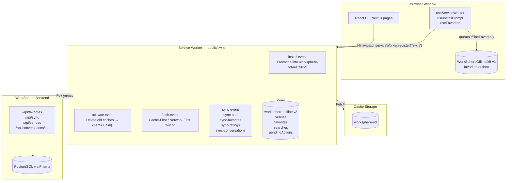
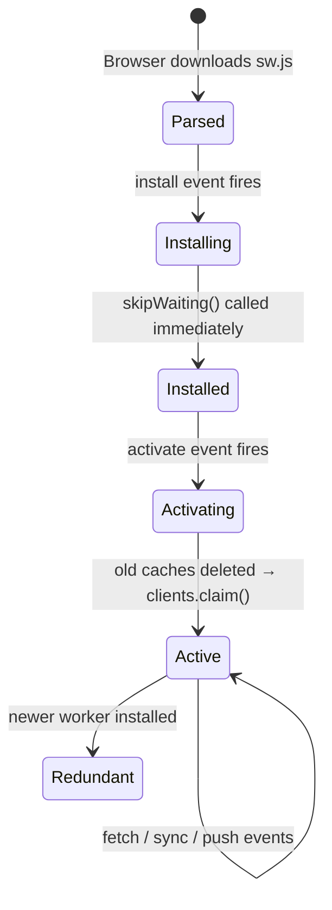

# PWA Testing Guidelines

A comprehensive testing guide for WorkSphere's Progressive Web App implementation. All procedures reference the actual source files and configuration values in this repository.

---

## Table of Contents

1. [Overview](#overview)
2. [PWA Architecture](#pwa-architecture)
3. [Service Worker Lifecycle](#service-worker-lifecycle)
4. [Local Database Validation](#local-database-validation)
5. [Offline Mode Testing](#offline-mode-testing)
6. [Chrome DevTools Offline Toggle](#chrome-devtools-offline-toggle)
7. [Cache Storage Validation](#cache-storage-validation)
8. [Network Caching Verification](#network-caching-verification)
9. [IndexedDB Inspection](#indexeddb-inspection)
10. [Update Testing](#update-testing)
11. [Cache Invalidation](#cache-invalidation)
12. [Common Issues and Troubleshooting](#common-issues-and-troubleshooting)
13. [Best Practices](#best-practices)

---

## Overview

WorkSphere ships as a Progressive Web App. The PWA layer provides:

- **Offline fallback** — navigation requests that cannot reach the network serve the cached `/offline` page.
- **Asset caching** — a service worker stores map tiles, images, and application pages so that previously visited content loads instantly without a network round-trip.
- **Background Sync** — user actions queued while offline (e.g., favouriting a venue) are automatically replayed when connectivity returns.
- **Installability** — the Web App Manifest enables installation to the home screen on Android and iOS.

### Source Files

| File                        | Responsibility                                                                                                                                         |
| --------------------------- | ------------------------------------------------------------------------------------------------------------------------------------------------------ |
| `public/sw.js`              | Service worker: install, activate, fetch, sync, push, and notification handlers                                                                        |
| `public/manifest.json`      | Web App Manifest: name, icons, `start_url`, display mode, theme colour                                                                                 |
| `src/hooks/usePWA.tsx`      | `useServiceWorker` hook (registration + update detection), `useInstallPrompt`, `PWABanner`, `OfflineIndicator`, `InstallAppButton`                     |
| `src/hooks/useFavorites.ts` | Optimistic offline favourite toggle; calls `queueOfflineFavorite` when offline                                                                         |
| `src/lib/offlineStore.ts`   | IndexedDB singleton (`WorkSphereOfflineDB v1`, store `favorites-outbox`); exports `queueOfflineFavorite`, `getQueuedFavorites`, `dequeueOfflineAction` |
| `src/app/offline/page.tsx`  | Offline fallback UI, served from the `worksphere-v3` cache                                                                                             |

---

## PWA Architecture



### Cache Namespace

The active cache name is defined at the top of `public/sw.js`:

```javascript
const CACHE_NAME = "worksphere-v3";
```

The install phase uses a temporary cache (`worksphere-v3-installing`) to avoid locking the main cache during asset pre-loading. After precaching succeeds, the temporary cache is deleted during activation.

### Two IndexedDB Databases

There are **two separate IndexedDB databases** used by WorkSphere.

| Database              | Version | Owner                     | Stores                                              | Purpose                                                                         |
| --------------------- | ------- | ------------------------- | --------------------------------------------------- | ------------------------------------------------------------------------------- |
| `worksphere-offline`  | 3       | `public/sw.js`            | `venues`, `favorites`, `searches`, `pendingActions` | Service-worker-side queue for CRDT, favourites, ratings, and conversation edits |
| `WorkSphereOfflineDB` | 1       | `src/lib/offlineStore.ts` | `favorites-outbox`                                  | Client-side favourites outbox consumed by `syncFavoritesOutbox()` in `sw.js`    |

---

## Service Worker Lifecycle



### Phase 1 — Install

During installation the service worker opens a temporary cache (`worksphere-v3-installing`) and precaches the following assets:

```javascript
const PRECACHE_ASSETS = ["/", "/offline", "/icons/icon.svg", "/manifest.json"];
```

`self.skipWaiting()` is called unconditionally (even on failure) to prevent the worker from becoming stuck in the `installing` state.

### Phase 2 — Activate

On activation the worker:

1. Deletes every cache whose name is not `worksphere-v3` and does not end with `-installing`.
2. Calls `self.clients.claim()` so that the new worker controls all open tabs immediately.
3. Deletes any leftover `-installing` caches.

### Phase 3 — Fetch

The worker intercepts all `GET` requests. The routing rules are:

| Condition                                                      | Strategy                                                                                             | Fallback            |
| -------------------------------------------------------------- | ---------------------------------------------------------------------------------------------------- | ------------------- |
| URL contains `/download`                                       | **Bypass** — passes through without interception                                                     | —                   |
| `method !== "GET"`                                             | **Bypass**                                                                                           | —                   |
| URL contains `/api/venues`                                     | **Network-First** — on success clones into `worksphere-v3`; on failure returns cached entry or `503` | `503 Offline`       |
| URL contains `tile.openstreetmap.org` or `images.unsplash.com` | **Cache-First** — on miss fetches and caches; accepts opaque responses (`status === 0`)              | `503 Asset Offline` |
| All other `GET` requests                                       | **Network-First** — on failure returns cached entry; for navigate requests returns cached `/offline` | `/offline` page     |

### Registration (Client Side)

The service worker is registered inside `useServiceWorker()` in `src/hooks/usePWA.tsx`:

```typescript
navigator.serviceWorker.register("/sw.js").then((reg) => {
  reg.update(); // check for updates on every page load
  reg.onupdatefound = () => {
    /* logs state changes */
  };
});
```

The hook also handles `controllerchange` to reload the page automatically after a new worker activates.

---

## Local Database Validation

### `worksphere-offline` (service worker side)

Open the database inside the service worker's `onupgradeneeded` handler. The schema is created at version 3.

| Store            | Key path              | Indices           |
| ---------------- | --------------------- | ----------------- |
| `venues`         | `id`                  | `type`, `savedAt` |
| `favorites`      | `id`                  | `savedAt`         |
| `searches`       | `query`               | `timestamp`       |
| `pendingActions` | `id` (auto-increment) | —                 |

> [!NOTE]
> The legacy store `pending-actions` (with a hyphen) is deleted during the v3 upgrade migration. If you see it in DevTools it means the database has not been upgraded — clear site data and reload.

### `WorkSphereOfflineDB` (client side)

Opened by `src/lib/offlineStore.ts` at version 1.

| Store              | Key path | Auto-increment |
| ------------------ | -------- | -------------- |
| `favorites-outbox` | `id`     | Yes            |

Each record in `favorites-outbox` has the shape:

```typescript
interface OfflineAction {
  id?: number;
  venueId: string;
  action: "ADD" | "REMOVE";
  timestamp: number;
}
```

#### Validation Steps

1. Navigate to **Application → IndexedDB** in Chrome DevTools.
2. Confirm that both `worksphere-offline` and `WorkSphereOfflineDB` are listed.
3. Expand `worksphere-offline` and verify all four object stores exist: `venues`, `favorites`, `searches`, `pendingActions`.
4. Expand `WorkSphereOfflineDB` and verify the `favorites-outbox` store exists.
5. If either database is absent, the service worker or `offlineStore.ts` has not yet initialised — navigate to a page that triggers data writes and reload.

---

## Offline Mode Testing

### Prerequisites

- Development server is running (`npm run dev`).
- The application has been loaded in Chrome at least once so that the service worker has installed and cached assets.
- Verify in **Application → Service Workers** that the status shows **activated and is running**.

### Full Offline Test Procedure

1. Open Chrome DevTools (`F12`).
2. Navigate to **Application → Service Workers**. Confirm:
   - Status: `activated and is running`
   - Source: `/sw.js`
3. Navigate to **Application → Cache Storage → worksphere-v3**. Confirm the precached assets are present:
   - `/`
   - `/offline`
   - `/icons/icon.svg`
   - `/manifest.json`
4. Navigate to **Network** tab. Set throttle profile to **Offline**.
5. Reload the application.
6. Expected results:

   | Test                                              | Expected Behaviour                                        |
   | ------------------------------------------------- | --------------------------------------------------------- |
   | Navigate to `/`                                   | Page loads from cache or offline fallback renders         |
   | Navigate to `/ai`                                 | Offline page (`/offline`) served with `WifiOff` icon      |
   | Previously visited venue detail page              | Content loads from cache                                  |
   | Map tiles (OpenStreetMap)                         | Previously cached tiles render; new tiles show blank      |
   | Unsplash images                                   | Previously cached images render; new images show blank    |
   | POST / DELETE requests                            | Bypass service worker — request fails at network layer    |
   | Download endpoint (`/api/bookings/[id]/download`) | Bypass service worker — fails gracefully at network layer |

7. Restore the **Network** throttle to **No throttling**.
8. Reload. The application should resume fetching live data normally.

### Testing the Offline Indicator

The `OfflineIndicator` component in `src/hooks/usePWA.tsx` renders a fixed amber banner when `navigator.onLine` is `false`. After setting the network to **Offline** in DevTools, the banner should appear within a few seconds as the browser fires the `offline` event.

---

## Chrome DevTools Offline Toggle

### Network Tab Toggle

The simplest way to test offline behaviour is the **Offline** preset in the **Network** tab:

1. Open DevTools → **Network**.
2. Click the **No throttling** dropdown.
3. Select **Offline**.

This blocks all network requests originating from the page, including sub-resource fetches and navigation requests. The service worker's network-first strategies will fall back to the cache or return `503` responses.

> [!IMPORTANT]
> The **Offline** toggle in the Network tab also blocks the service worker's own `fetch()` calls. This is the correct way to test end-to-end offline behaviour.

### Service Workers Panel Toggle

The **Offline** checkbox inside **Application → Service Workers** only affects requests that pass through the service worker. Requests that bypass the service worker (e.g., non-GET requests) are not blocked. Use this toggle to test the service worker's fallback path in isolation.

To access it:

1. DevTools → **Application** → **Service Workers**.
2. Check the **Offline** checkbox next to the registered `sw.js` entry.

### Simulating Push Events

To test push notification handling without a real push server:

1. DevTools → **Application** → **Service Workers**.
2. In the **Push** field, enter a JSON payload:

   ```json
   {
     "title": "WorkSphere",
     "body": "A workspace is now available near you.",
     "url": "/ai"
   }
   ```

3. Click **Push**. The service worker's `push` handler will call `self.registration.showNotification()` with the icon `/icons/icon.svg` and actions `open` / `dismiss`.

### Triggering Background Sync Manually

If the browser has not automatically fired the sync event after network restoration:

1. DevTools → **Application** → **Service Workers**.
2. In the **Sync** input field, type the sync tag.
3. Click **Sync**.

Available sync tags (defined in `public/sw.js`):

| Tag                  | Handler function                               |
| -------------------- | ---------------------------------------------- |
| `sync-crdt`          | `syncCrdt()`                                   |
| `sync-favorites`     | `syncFavorites()` then `syncFavoritesOutbox()` |
| `sync-ratings`       | `syncRatings()`                                |
| `sync-conversations` | `syncConversations()`                          |

---

## Cache Storage Validation

### Checking the Active Cache

1. DevTools → **Application** → **Cache Storage**.
2. Expand the `worksphere-v3` entry.

The cache should contain at minimum:

```text
/
/offline
/icons/icon.svg
/manifest.json
```

Additional entries are added dynamically by the fetch handler as the user navigates and loads images.

### Confirming Cache-First for External Assets

1. Visit the map page while online. Map tiles from `tile.openstreetmap.org` are fetched and written to `worksphere-v3`.
2. Go to **Application → Cache Storage → worksphere-v3**. Filter by `tile.openstreetmap.org` in the preview.
3. Enable **Offline** in the Network tab.
4. Navigate back to the map page. The previously loaded tiles should still render.

### Confirming Network-First for `/api/venues`

1. Open the **Network** tab (not Offline) and navigate to a page that calls `/api/venues`.
2. Confirm the request reaches the server and returns a `200` response.
3. Enable **Offline**.
4. Navigate to the same page. The service worker attempts the network request, receives a network error, and returns the cached copy. The response in the **Network** tab will show the request handled by the service worker with the previously cached body.
5. Disable **Offline**. On the next load, a fresh response is fetched and the cache entry is updated.

### Inspecting Cache Entries

To inspect a specific cached response:

1. Click the entry name in the Cache Storage panel.
2. The right pane shows the cached response headers and, for text responses, a preview of the body.

---

## Network Caching Verification

### Network Tab Indicators

After the service worker is active, cached responses appear in the **Network** tab with:

- **Size**: `(ServiceWorker)` or `(disk cache)` instead of a byte count
- **Status**: `200` (from cache) or `503` (generated fallback)

To identify which caching strategy served a response:

1. Open DevTools → **Network**.
2. Load a page.
3. Click the request row and open the **Headers** tab. The `X-Cache-Status` header is not set by this service worker, so rely on the **Size** column instead.

### Verifying Bypass Behaviour

The following request types must **not** be intercepted by the service worker:

- `POST`, `PUT`, `DELETE`, `PATCH` requests (any URL)
- `GET /api/bookings/[id]/download`

To verify:

1. Open DevTools → **Network**.
2. Trigger a mutation (e.g., toggle a favourite while online).
3. Confirm the POST appears in the Network tab with `200` and a real byte count, **not** `(ServiceWorker)`.
4. Trigger a PDF download.
5. Confirm the response is not intercepted — it should download directly from the server.

---

## IndexedDB Inspection

### Inspecting `worksphere-offline` (Service Worker Queue)

1. DevTools → **Application** → **IndexedDB** → **worksphere-offline**.
2. Select a store from the left:

   - **`pendingActions`** — inspect for queued offline actions. Each record has a `type` field with values such as `crdt-sync`, `favorite`, `unfavorite`, `ratings`, `rate`, `conversation-rename`, or `conversation-delete`.
   - **`venues`** — shows cached venue data.
   - **`favorites`** — shows locally cached favourites.
   - **`searches`** — shows cached search queries.

3. After a successful background sync, `pendingActions` entries are deleted. If entries remain after connectivity is restored, the sync failed — check the console for errors.

### Inspecting `WorkSphereOfflineDB` (Client Outbox)

1. DevTools → **Application** → **IndexedDB** → **WorkSphereOfflineDB**.
2. Select **`favorites-outbox`**.
3. Each entry has fields: `id`, `venueId`, `action` (`"ADD"` or `"REMOVE"`), `timestamp`.

When the page is offline and the user toggles a venue favourite:

- `useFavorites.ts` calls `queueOfflineFavorite(venueId, actionType)` from `src/lib/offlineStore.ts`.
- A new record appears in `favorites-outbox`.

When the `sync-favorites` event fires in the service worker:

- `syncFavoritesOutbox()` calls `getQueuedFavorites()` → iterates → calls `dequeueOfflineAction(action.id)`.
- The record is deleted from `favorites-outbox`.

### Manual Console Inspection

You can query IndexedDB directly from the DevTools console to verify state without the UI:

```javascript
// Open worksphere-offline and read all pendingActions
const req = indexedDB.open("worksphere-offline", 3);
req.onsuccess = (e) => {
  const db = e.target.result;
  const tx = db.transaction("pendingActions", "readonly");
  const store = tx.objectStore("pendingActions");
  store.getAll().onsuccess = (ev) => console.table(ev.target.result);
};
```

```javascript
// Open WorkSphereOfflineDB and read all favorites-outbox entries
const req = indexedDB.open("WorkSphereOfflineDB", 1);
req.onsuccess = (e) => {
  const db = e.target.result;
  const tx = db.transaction("favorites-outbox", "readonly");
  const store = tx.objectStore("favorites-outbox");
  store.getAll().onsuccess = (ev) => console.table(ev.target.result);
};
```

---

## Update Testing

### How Updates Work

When `public/sw.js` is modified and the browser detects a byte change, the following sequence runs automatically:

1. The browser downloads the new `sw.js` and starts a new installing worker alongside the current active worker.
2. The installing worker opens `worksphere-v3-installing` and precaches assets.
3. `skipWaiting()` is called immediately — the new worker activates without waiting for tabs to close.
4. The active worker fires `activate`, deletes old caches, and calls `clients.claim()`.
5. `useServiceWorker()` listens for `controllerchange` and calls `window.location.reload()`.
6. The page reloads and is now controlled by the new worker.

### Testing an Update

1. Start the dev server and load the application. Confirm the service worker is active.
2. Modify `public/sw.js` — for example, change `CACHE_NAME` from `"worksphere-v3"` to `"worksphere-v4"`.
3. Reload the page in Chrome.
4. In DevTools → **Application → Service Workers**, you should see two workers: the old one (activated) and the new one (installing/waiting/activated).
5. Because `skipWaiting()` is called immediately, the new worker should activate within seconds and the page will reload automatically.
6. Confirm in **Cache Storage** that `worksphere-v4` now exists and the old `worksphere-v3` has been deleted.

### Force-Activating During Development

Enable **Update on reload** in DevTools → **Application → Service Workers** to force the new service worker to install and activate on every page refresh without waiting:

1. DevTools → **Application** → **Service Workers**.
2. Check **Update on reload**.
3. Reload. The new worker is immediately activated on every page load.

> [!WARNING]
> Leave **Update on reload** disabled in production testing. It bypasses the normal `skipWaiting` lifecycle and may hide real activation delays.

---

## Cache Invalidation

### Automatic Invalidation on Activate

Old caches are deleted during the `activate` event. The service worker keeps only the cache named exactly `worksphere-v3` (and any in-progress `-installing` cache). All other caches are deleted:

```javascript
cacheNames
  .filter((name) => name !== CACHE_NAME && !name.endsWith("-installing"))
  .map((name) => caches.delete(name));
```

To release an old cache:

1. Increment `CACHE_NAME` in `public/sw.js` (e.g., from `"worksphere-v3"` to `"worksphere-v4"`).
2. Deploy the updated `sw.js`.
3. On next activation the old cache is deleted automatically.

### Manual Cache Deletion (Development)

To clear the cache without deploying a new worker version:

**Option A — Clear a single cache via DevTools:**

1. DevTools → **Application** → **Cache Storage**.
2. Right-click `worksphere-v3`.
3. Select **Delete**.

**Option B — Clear all site data:**

1. DevTools → **Application** → **Storage**.
2. Click **Clear site data**.
3. This deletes all caches, IndexedDB databases, and unregisters the service worker.

**Option C — Console:**

```javascript
caches.delete("worksphere-v3").then((ok) => console.log("Deleted:", ok));
```

To delete all caches:

```javascript
caches
  .keys()
  .then((names) => Promise.all(names.map((n) => caches.delete(n))))
  .then(() => console.log("All caches cleared"));
```

### Verifying No Stale Cache Remains

After bumping `CACHE_NAME` and deploying, verify no old cache exists:

1. DevTools → **Application** → **Cache Storage**.
2. Confirm that only `worksphere-v3` (or the new version) is listed.
3. If an old cache is still present, unregister the service worker manually, clear site data, and reload.

---

## Common Issues and Troubleshooting

### Service Worker Not Registering

| Symptom                                                | Cause                                             | Fix                                                                                                   |
| ------------------------------------------------------ | ------------------------------------------------- | ----------------------------------------------------------------------------------------------------- |
| No service worker in **Application → Service Workers** | `sw.js` is not accessible at the root path        | Confirm `public/sw.js` exists and `GET /sw.js` returns 200                                            |
| Registration error in console                          | Syntax error in `sw.js`                           | Check browser console for the error message and line number                                           |
| Service worker registers but is not active             | `skipWaiting` not reached due to precache failure | Precaching is designed to call `skipWaiting()` even on failure; confirm in the service worker console |

To open the service worker's own console:

1. DevTools → **Application** → **Service Workers**.
2. Click **Inspect** next to the registered worker.

---

### Offline Page Not Serving

| Symptom                                                   | Cause                                      | Fix                                                                                          |
| --------------------------------------------------------- | ------------------------------------------ | -------------------------------------------------------------------------------------------- |
| Browser shows default network error instead of `/offline` | `/offline` was never cached during install | Confirm `/offline` is in `PRECACHE_ASSETS`; clear site data and reload to re-trigger install |
| `/offline` not found (404)                                | `src/app/offline/page.tsx` does not exist  | Verify the file exists and the dev server compiles it successfully                           |
| Offline page shows but with missing styles                | CSS assets not in the cache                | Reload the page once while online so CSS is fetched and cached by the network-first handler  |

---

### Background Sync Not Running

| Symptom                                                           | Cause                                      | Fix                                                                                          |
| ----------------------------------------------------------------- | ------------------------------------------ | -------------------------------------------------------------------------------------------- |
| `pendingActions` entries remain after going back online           | Browser does not support Background Sync   | Verify support: `"SyncManager" in window.registration` in the service worker console         |
| Sync fires but API returns an error                               | Backend unavailable or auth expired        | Check the Network tab for the sync request and inspect the response status                   |
| `syncConversations` not processing all entries                    | Timestamp ordering issue                   | Records are sorted by `a.timestamp - b.timestamp`; verify timestamps are populated correctly |
| `syncFavoritesOutbox` runs but entries stay in `favorites-outbox` | `dequeueOfflineAction` receives wrong `id` | Confirm that the record's `id` is an auto-incremented integer, not `undefined`               |

To check whether the sync API was called:

1. DevTools → **Application** → **Service Workers** → **Inspect**.
2. In the service worker console, look for `"Sync CRDT failed:"`, `"Sync favorites failed:"`, or equivalent error messages.

---

### Old Cached Assets Served After Update

| Symptom                                      | Cause                                      | Fix                                                                                                  |
| -------------------------------------------- | ------------------------------------------ | ---------------------------------------------------------------------------------------------------- |
| CSS / JS changes not visible after deploying | Browser still using the old service worker | Enable **Update on reload** in DevTools and reload; or unregister and clear site data                |
| `worksphere-v3` cache contains old entries   | Cache not cleared after version bump       | Bump `CACHE_NAME` in `sw.js` to trigger automatic deletion on next activate                          |
| Two service workers shown in DevTools        | New worker is waiting                      | `skipWaiting()` should activate it immediately; if stuck, click **skipWaiting** in DevTools manually |

---

### IndexedDB Upgrade Migration Not Applied

If the `worksphere-offline` database is still at version 1 or 2, the `pendingActions` store may not exist.

Verify the version:

```javascript
const req = indexedDB.open("worksphere-offline");
req.onsuccess = (e) => console.log("DB version:", e.target.result.version);
```

If the version is not `3`:

1. DevTools → **Application** → **IndexedDB**.
2. Right-click `worksphere-offline` → **Delete database**.
3. Reload. The service worker re-creates the database at version 3.

---

### PWA Install Prompt Not Appearing

| Symptom                            | Cause                                                          | Fix                                                                                                                                  |
| ---------------------------------- | -------------------------------------------------------------- | ------------------------------------------------------------------------------------------------------------------------------------ |
| `PWABanner` never renders          | `beforeinstallprompt` not fired                                | Chrome only fires this event when all PWA installability criteria are met; verify `manifest.json` is valid and `sw.js` is registered |
| Banner dismissed permanently       | `localStorage.setItem("pwa-banner-dismissed", "true")` was set | Clear `localStorage` in DevTools → **Application → Storage**                                                                         |
| iOS install instructions not shown | `isIOS` detection returns `false`                              | `useInstallPrompt` checks `userAgent` for `ipad`, `iphone`, `ipod`; verify you are testing on an actual iOS Safari browser           |

---

### `WorkSphereOfflineDB` Connection Not Singleton

`src/lib/offlineStore.ts` uses a singleton pattern to prevent multiple `indexedDB.open()` calls. If you see `"IndexedDB is not available on server-side"` in the console:

- This error is intentional — `getDB()` checks `typeof indexedDB === "undefined"` and rejects in SSR/Node environments.
- On the client, this error should never appear. If it does, a component is calling `queueOfflineFavorite` or `getQueuedFavorites` during server-side rendering.

To verify the singleton is working:

```javascript
// In the browser console
// Should only open one connection; second call resolves immediately
import("/sw.js"); // this is illustrative — the module is loaded by the build
```

---

## Best Practices

1. **Always test with a freshly installed service worker.** Clear site data before starting a new test session to ensure you are testing the actual install path, not a cached state.

2. **Use the service worker's dedicated console.** DevTools → **Application → Service Workers → Inspect** opens a separate console for the worker context. Service worker `console.log` and error output appears here, not in the main page console.

3. **Test cache strategies independently.** Use the **Offline** checkbox in the Service Workers panel (not the Network tab) to test only the service worker's cache fallback without blocking the service worker's own `fetch()` calls to APIs.

4. **Check both IndexedDB databases.** WorkSphere uses two separate databases (`worksphere-offline` and `WorkSphereOfflineDB`). Inspecting only one may lead to missing queued entries.

5. **Verify Background Sync tags exactly.** The tags `sync-crdt`, `sync-favorites`, `sync-ratings`, and `sync-conversations` must be typed exactly as defined in `public/sw.js` when triggering them manually from DevTools.

6. **Do not modify `CACHE_NAME` in `sw.js` without updating all references.** Changing the cache name triggers cache invalidation on the next activation. Confirm the new cache name is consistent across the install, activate, and fetch event handlers.

7. **Verify the download endpoint bypass.** PDF download requests (`/api/bookings/[id]/download`) intentionally bypass the service worker to prevent binary stream locking. Confirm these requests appear as direct network requests in the Network tab, not as `(ServiceWorker)` responses.

8. **Confirm opaque response handling for external images.** Cache-First for `images.unsplash.com` accepts `status === 0` (opaque cross-origin response). Do not add a `response.ok` check for these — a `status === 0` is expected and should be cached.

9. **Test the update lifecycle end-to-end before releasing.** Make a trivial change to `sw.js` on your branch, reload the app, and confirm the new worker activates and the old cache is deleted before merging.

10. **Clear `pwa-banner-dismissed` from localStorage when testing the install banner.** The `PWABanner` component reads this flag on mount; stale dismissal state from a previous test session will suppress the banner.

11. **On Safari, Background Sync is unavailable outside standalone mode.** WorkSphere relies on the browser firing the `sync` event. On Safari iOS, this event is not supported unless the app is installed to the home screen in standalone display mode. Test sync fallback paths separately on Safari.

12. **Run a pre-merge verification checklist for all PWA-related PRs:**

    - [ ] Service worker registers successfully and status is `activated and is running`
    - [ ] `manifest.json` loads without errors (`/manifest.json` returns `200`)
    - [ ] Cache Storage contains `worksphere-v3` with all four precached assets
    - [ ] `worksphere-offline` database exists at version `3` with all four stores
    - [ ] `WorkSphereOfflineDB` exists at version `1` with `favorites-outbox`
    - [ ] Offline navigation serves the `/offline` fallback page
    - [ ] Previously cached routes and map tiles load while offline
    - [ ] Favouriting a venue while offline writes a record to `favorites-outbox`
    - [ ] `favorites-outbox` record is removed after network is restored and sync fires
    - [ ] No errors in the service worker console during install, activate, fetch, or sync phases
    - [ ] PDF download endpoint (`/api/bookings/[id]/download`) bypasses the service worker
    - [ ] POST / PUT / DELETE requests bypass the service worker and are not intercepted
