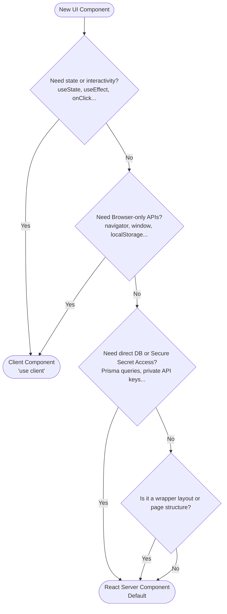

# Next.js App Router: React Server Components vs. Client Components Decision Guide

## Overview

In Next.js App Router (which WorkSphere uses), components are **React Server Components (RSC)** by default. Server Components fetch data, query databases, and execute logic closer to the server. You can opt into **Client Components (CC)** by declaring the `"use client"` directive at the top of a file.

This document serves as a reference guide for WorkSphere developers to make architectural decisions on when to keep components as RSCs vs. when to promote them to Client Components.

---

## Core Differences

| Feature                     | React Server Component (RSC)                           | Client Component (CC)                                        |
| :-------------------------- | :----------------------------------------------------- | :----------------------------------------------------------- |
| **Execution Environment**   | Server-side only (during build or request time)        | Server-side pre-rendering (SSR) + Client-side hydration      |
| **Default in App Router**   | Yes                                                    | No (requires `"use client"` directive)                       |
| **Browser APIs Access**     | ❌ No (no `window`, `document`, `navigator`, etc.)     | Yes (can access Geolocation, Web Audio, local storage, etc.) |
| **React Hooks Access**      | ❌ No (no `useState`, `useEffect`, `useContext`, etc.) | Yes (all standard and custom React hooks)                    |
| **Direct Database / APIs**  | Yes (can query database directly via Prisma/SQL)       | ❌ No (must communicate via Server Actions or API routes)    |
| **Client-Side Bundle Size** | Zero bytes (code is not sent to the browser)           | Included in the client-side bundle                           |

---

## Next.js App Router Decision Tree

Use this visual workflow to determine which type of component to build:



---

## Examples from the WorkSphere Codebase

### 1. React Server Components (RSC)

Server Components are ideal for static layouts, server redirect validations, dynamic server metadata generation, and direct server-side data fetching.

#### Auth & Redirect Validation — [src/app/social/page.tsx](file:///c:/5th%20Sem/GSSOC/WorkSphere/src/app/social/page.tsx)

This page checks authentication credentials securely on the server using Clerk's `auth()` helper before returning the view, avoiding flashing loading states or client-side redirects:

```typescript
import { auth } from "@clerk/nextjs/server";
import { redirect } from "next/navigation";
import SocialWorkspaceClient from "./social-workspace-client";

export default async function SocialPage() {
  const { userId } = await auth();

  if (!userId) {
    redirect("/sign-in");
  }

  return <SocialWorkspaceClient />;
}
```

#### Direct Database Query & Metadata Generation — [src/app/sessions/\[slug\]/page.tsx](file:///c:/5th%20Sem/GSSOC/WorkSphere/src/app/sessions/%5Bslug%5D/page.tsx)

This route directly retrieves a session from Prisma on the server to dynamically generate SEO metadata, and then passes the serialized data to a client dashboard:

```typescript
import { notFound } from "next/navigation";
import { prisma } from "@/lib/prisma";
import SessionDetailClient from "./session-detail-client";

export async function generateMetadata({ params }) {
  const { slug } = await params;
  const session = await prisma.coworkingSession.findUnique({
    where: { slug },
    include: { venue: true },
  });

  if (!session) return { title: "Session not found" };
  return { title: `${session.title} | WorkSphere` };
}

export default async function SessionPage({ params }) {
  const { slug } = await params;
  const session = await prisma.coworkingSession.findUnique({
    where: { slug },
    include: { venue: true, host: true, rsvps: true },
  });

  if (!session) notFound();

  // Serialized Prisma object passed to Client Component
  return <SessionDetailClient session={JSON.parse(JSON.stringify(session))} />;
}
```

---

### 2. Client Components (CC)

Client Components are required whenever your code relies on client-side state, event handlers, animations, or browser-specific capabilities.

#### Interactive Multi-Agent Chatbot — [src/components/EnhancedChatbot.tsx](file:///c:/5th%20Sem/GSSOC/WorkSphere/src/components/EnhancedChatbot.tsx)

Uses states (`useState`), lifecycle events (`useEffect`), cursor tracking, and a WebSocket connection (`useMultiplayerSession`) to handle client-side message streams:

```typescript
"use client";

import { useEffect, useRef, useState } from "react";
import { useMultiplayerSession } from "@/hooks/useRealTime";

export function EnhancedChatbot({ onMapUpdate, userLocation }) {
  const [messages, setMessages] = useState([]);
  const [input, setInput] = useState("");
  // ... WebSockets socket subscription, typing event handlers, etc.
}
```

#### Decibel Sound Analyzer — [src/components/noise/NoiseMeter.tsx](file:///c:/5th%20Sem/GSSOC/WorkSphere/src/components/noise/NoiseMeter.tsx)

Accesses the browser's Web Audio API and captures real-time microphone frequencies using a Canvas element, which requires direct access to browser objects:

```typescript
"use client";

import { useEffect, useRef, useState } from "react";

export function NoiseMeter({ onMeasured }) {
  const [status, setStatus] = useState("idle");
  const canvasRef = useRef<HTMLCanvasElement | null>(null);

  async function measure() {
    const stream = await navigator.mediaDevices.getUserMedia({ audio: true });
    const audioContext = new AudioContext();
    const analyser = audioContext.createAnalyser();
    // ... draws audio frequencies on canvasRef.current
  }
}
```

---

## Common Pitfalls & Workarounds

### 1. Non-Serializable Props

#### The Pitfall:

When passing data from a Server Component to a Client Component, the props must be **serializable** (i.e. transferable via JSON). Passing raw JavaScript objects containing `Date` instances, functions, or complex classes will throw a Next.js serialization error.

```typescript
// ❌ FAILS: session.createdAt is a raw JavaScript Date object
return <SessionDetailClient session={session} />;
```

#### The Workaround:

Explicitly serialize the server data to JSON before passing it, or parse it to a simple string:

```typescript
//  WORKS: Serializes dates and complex properties into simple types
return <SessionDetailClient session={JSON.parse(JSON.stringify(session))} />;
```

---

### 2. Client-Only Browser Objects & Hydration Mismatch

#### The Pitfall:

During pre-rendering, Next.js executes Client Components on the server. If you reference global browser variables like `window`, `document`, or `navigator` directly in the rendering scope, Next.js will crash with `ReferenceError: window is not defined` or produce hydration mismatches.

```typescript
// ❌ FAILS: window does not exist during server-side pre-rendering
const screenWidth = window.innerWidth;
```

#### The Workaround:

Guard references to browser APIs using `typeof window` checks, or only execute them inside a `useEffect` hook, which runs exclusively on the client after hydration:

```typescript
//  WORKS: Wrapped inside useEffect
const [width, setWidth] = useState(0);
useEffect(() => {
  setWidth(window.innerWidth);
}, []);
```

Or use a client-safe check:

```typescript
if (typeof window !== "undefined") {
  // Safe to access window/document
}
```

---

### 3. Unintentional Client Component Propagation

#### The Pitfall:

Declaring `"use client"` at the very top of a root layout or a top-level page promotes the **entire sub-tree** of imported components to the client, negating the performance benefits of React Server Components.

```typescript
// ❌ BAD PRACTICE: Entire page and all imported layout panels become Client Components
"use client";
import SidebarPanel from "@/components/SidebarPanel";
import ComplexDataGrid from "@/components/ComplexDataGrid";
```

#### The Workaround:

Move interactivity into leaf-level components. Keep the main container/page as a Server Component and import interactive client widgets selectively.

---

### 4. Importing Server Components into Client Components

#### The Pitfall:

You cannot directly import and render a Server Component inside a file marked with `"use client"`. Next.js will automatically treat the imported Server Component as a Client Component, converting its server logic.

```typescript
"use client";
// ❌ BAD PRACTICE: ServerComponent will be promoted to a Client Component
import ServerComponent from "@/components/ServerComponent";

export default function ClientWidget() {
  return <ServerComponent />;
}
```

#### The Workaround:

Pass the Server Component as a `children` prop or a custom component slot inside a parent Server Component:

```typescript
// ClientWidget.tsx ("use client")
export default function ClientWidget({ children }: { children: React.ReactNode }) {
  return <div className="interactive-container">{children}</div>;
}

// ParentPage.tsx (RSC)
import ClientWidget from "./ClientWidget";
import ServerComponent from "./ServerComponent";

export default function ParentPage() {
  return (
    <ClientWidget>
      <ServerComponent /> {/* Renders correctly as RSC on the server */}
    </ClientWidget>
  );
}
```
